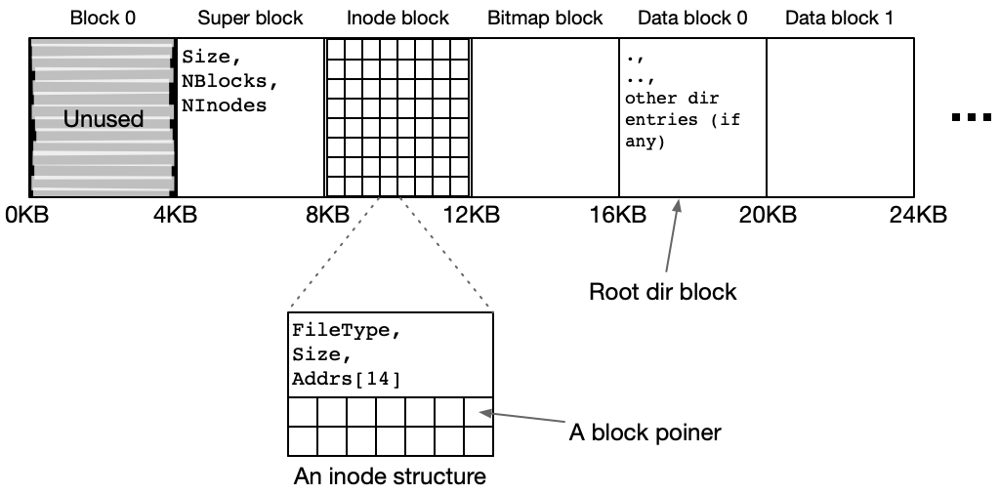

## Important Dates and Other Stuff

**Due** Thursday, 05/07, midnight.

## Background

In this project, you will be developing a working **distributed file
system**, which we call **Mason Distributed File System** or
**MDFS**. We provide you with only the bare minimal skeleton
framework; you have to build the rest.

## A Basic File Server

Your file server is built as a standalone RPC server. It should wait
for a message and then process the message as needed, replying to 
the given client. 

Your file server will store all of its data in an on-disk file, which
will be referred to as a *file system image*. This image contains 
the on-disk representation of your data structures; you should use 
these already-implemented interfaces to read/write it: 

* `utils.Serialize()`: serializes a Go `struct` data object into a `[]byte` array.

* `utils.Deserialize()`: deserializes a `[]byte` array into Go `struct` data object.

* `utils.ReadBlock()`: 
reads a data block from the file system image at the given block
offset.

* `utils.WriteBlock()`: 
writes a data block to the file system image at the given block offset.

To access the file server, you will be implementing the corresponding
RPC-based file system interfaces. 

## On-Disk File System Image

Your on-disk file system will be similar to the file system format
described in our lecture. A few (hard-coded) configuration parameters
are listed as follows:
 
* Block size in MDFS will be 4096 bytes (4 KB). 

* There will be only 14 direct pointers in an inode. You do not need
to implement indrect pointers.

* There will be a maximum of 64 inodes (i.e., each inode spans 64
bytes so that 64 inodes would fit inside one block) in the file
system. 

* There will be a maximum of 1024 data blocks in the file system.

`common.go` defines all the structures and the constants that will be
used for formatting the file system image.  

  

The above figure depicts the layout of the file system image.  The
very first block of the file system image, block 0, is unused, and
should never be touched. Starting from block 1, the next 3
consecutive blocks (i.e., block 1, block 2, and block 3) store super
block, the entire set of inodes, and a bitmap.  Block 4 (the first
data block, or data block 0) is reserved for the root directory.  
Specifically, the on-disk structures are
defined as follows:

* **Super block:**
A super block (defined as `type SuperBlock struct` in `common.go`) is
a simple metadata data structure that contains three fields: a `Size`
field indicating the size of the file system image in blocks
(including both metadata blocks and data blocks), a `NBlocks` field
indicating the number of data blocks of the file system image, and a
`NInodes` field indicating the number of inodes in the file system.

* **Inodes:** 
An inode (defined as `type Inode struct` in `common.go`) is a simple
structure that contains a `FileType` field, a `Size` field, an an
array of direct pointers (`Addrs`). The total size of each inode is
64 bytes, and hence a 4096-byte block can store 64 inodes. A
`FileType` of 0 indicates that the inode is unused; a `FileType` of 1
indicates that the inode is used by a directory; a `FileType` of 2
indicates that the inode is used by a file.

* **Bitmap:** 
A 4-KB bitmap is used to keep track of the block usage of the file
system image. Each bit in the bitmap is associated with a data block.
The first bit of the bitmap represents the first data block (data
block 0).

* **Data blocks:**
There are two types of data blocks: *directory blocks* and *file
blocks*.  The directory blocks are data blocks that store directory
entries (`type MFS_DirEnt struct`); the file blocks are data blocks
that store a (part of a) file.

* **Directories:** 
Each directory has an inode and points to one or more data blocks
that contain directory entries. Each directory entry (defined as
`type MFS_DirEnt struct` in `common.go`) should be simple and
consists of 64 bytes: a `Name` field and an `Inum`, inode number
field.  The name of a directory entry should be a fixed-length field
with a maximum of 60 bytes; the inode number is an `int32` typed,
4-byte integer. When a directory is created, it should contain two
entries: a name `.`, which refers to this new directory's inode
number, and a name `..`, which refers to the parent directory's inode
number. For directory entries that are not yet in use (in an
allocated, 4-KB directory block), the inode number should be set to
-1. This way, utilities can scan through the entries to check if they
are valid.

When your server is started, it is passed the name of the file system
image file. If this file does not exist, the file server should
create it, initialize it properly, and force it to disk. Such
initialization includes creating the super block, inodes, bitmap, and
creating a single root directory with proper `.` and `..` entries.
The inode number of the root directory should be 0.

When booting off of an existing image, your server should read in the
super block, inodes, and the bitmap (and keep an in-memory version of
them).

## File Server's RPC Interfaces

The file server should export the following RPC interfaces, which are
already included in `fileserver/fileserver.go`:

* `RPCCreat(args mdfs.CreatArg, reply *mdfs.CreatReply)`: 
Makes a file (`FileType == MFS_ERGULAR_FILE`) or
directory (`FileType == MFS_DIRECTORY`) in the parent directory
specified by `PInum` of name `Name` (defined in `type CreatArg
struct` in `common_rpc.go`). Returns 0 on success and -1 on failure
(`CreatReply` in `common_rpc.go`).
Failure modes: `PInum` does not exist, or name is too long. If `Name`
already exists, return success (think about why).

* `RPCLookup(args mdfs.LookupArg, reply *mdfs.LookupReply)`:
Takes the parent inode number `PInum` (which is the inode number of a
directory), which is defined in `LookupArg` in `common_rpc.go`, and
looks up the entry `Name` in it. The inode number of `Name` is
returned (`LookupReply` in `common_rpc.go`). 
Failure modes: invalid `PINum`, `Name` does not exist in 
`PINum`.

* `RPCRead(args mdfs.ReadArg, reply *mdfs.ReadReply)`:
Reads a block at the block offset specified by `BlockIdx` (`ReadArg`
in `common_rpc.go`) from a file specified by `Inum` into the buffer
specified by `Data []byte` in `ReadReply`.  This function should work
for either a file or a directory; directories should return data in
the format specified by `MFS_DirEnt`. On success return 0; on failure
return -1. 
Failure modes: invalid `Inum`, invalid `BlockIdx`.

* `RPCWrite(args mdfs.WriteArg, reply *mdfs.WriteReply)`:
Writes a block of size 4096 bytes from the buffer specified by
`Data []byte` into the block offset specified by
`BlockIdx` (`WriteArg` in `common_rpc.go`). 
On success return 0; on failure return -1. 
Failure modes: invalid `Inum`, invalid `BlockIdx`, not
a regular file (because you can't write to directories).

* `RPCStat(args mdfs.StatArg, reply *mdfs.StatReply)`:
Returns some information about the file specified by 
`Inum` (`StatArg` in `common_rpc.go`). On success, return 0;
on failure return -1. The exact information returned is defined
by `type MFS_Stat struct` in `common.go`. 
Failure modes: `Inum` does not exist.

* `RPCUnlink(args mdfs.UnlineArg, reply *mdfs.UnlinkReply)`:
Removes the file or directory `Name` (`UnlinkArg` in `common_rpc.go`)
from the directory specified by `PInum`. On success return 0;
otherwise return -1. 
Failure modes: `PInum` does not exist, directory is **NOT** empty.
Note that a `Name` that does not exist is **NOT** a failure by our
definition (think about why this might be).

